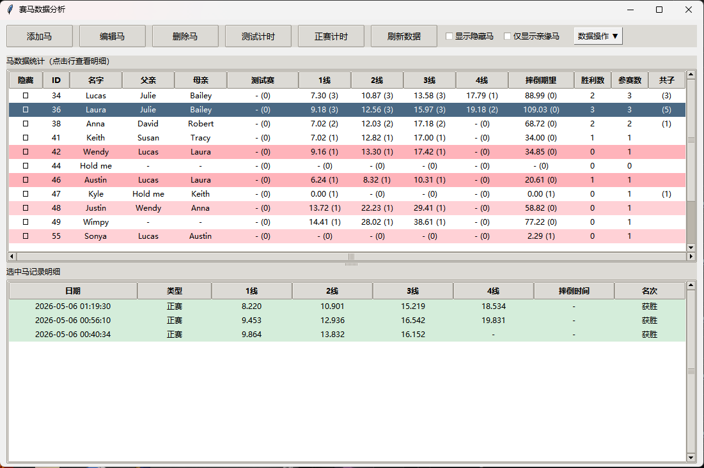

# Horsey Game Monitor

Horsey Game 专用赛马数据分析器。一个基于 Python + Tkinter 的桌面工具，用于管理马、记录比赛计时、分析统计数据，并可视化血缘谱系。



## 功能特性

### 🐴 马管理
- **添加马**：支持随机生成英文名（自动去重、限制7字符内）、一键复制名称
- **编辑马**：随时修改马的名字、父亲、母亲
- **删除马**：删除马及其所有历史记录
- **隐藏马**：标记不活跃的马，可控制是否在列表中显示
- **ID 自增**：自动分配唯一 ID

### ⏱️ 计时系统
- **测试计时**：记录测试时间，支持记录摔倒时间
- **正赛计时**：完整记录 1 线 / 2 线 / 3 线 / 4 线 / 摔倒时间
  - 记录3线自动勾选获胜
  - 记录摔倒自动取消获胜
- 计时器支持开始 / 暂停 / 归零 / 手动编辑时间

### 📊 数据统计
主表格实时汇总每匹马的：
- 测试赛平均时间（样本量）
- 1 线 / 2 线 / 3 线 / 4 线平均时间（样本量）
- 摔倒期望：总跑动时间 / (摔倒次数 + 0.5)
- 胜利数、参赛数
- **共子**：未选中时显示自己的子女数；选中某匹马时，显示与该马共同育有的子女数

支持点击列头升序/降序排序。

### 🩸 血缘可视化
- 选中某匹马时：
  - **祖先**淡蓝色高亮（越近越深）
  - **后代**淡粉色高亮（越近越深）
  - 自身黄色高亮
- 共子列同步显示共同子女数量
- 支持"仅显示亲缘马"过滤，快速聚焦血统关系
- 再次点击已选中的行可取消选中

### 📝 记录明细
- 选中马后下方自动显示该马所有历史记录
- 获胜 → 浅绿色高亮
- 摔倒 → 浅红色高亮

### 💾 数据导入导出
- **导出**：保存为带时间戳的 ZIP（`horsey_monitor_YYYYMMDD_HHMMSS.zip`），默认文件名已预填
- **导入**：选择 ZIP 文件覆盖现有数据
- **清空**：一键清空所有数据（不可恢复）

## 运行方式

### 环境要求
- Python 3.10+
- `tkinter`（Python 内置）
- `faker`

### 安装依赖
```bash
pip install faker
```

### 启动
```bash
python horse_racing.py
```

数据文件（`horses.csv`、`records.csv`）会自动生成在当前目录。

## 数据文件说明

| 文件 | 内容 |
|---|---|
| `horses.csv` | 马基础信息：ID、名字、父亲 ID、母亲 ID、添加日期、隐藏状态 |
| `records.csv` | 计时记录：记录 ID、马 ID、马名、日期、模式、1线、2线、3线、4线、摔倒时间、名次 |

## 界面布局

- **上半区**：马数据统计表格（可拖动调整高度）
- **下半区**：选中马的记录明细
- **顶部工具栏**：添加 / 编辑 / 删除 / 测试计时 / 正赛计时 / 刷新 / 显示隐藏 / 仅显示亲缘 / 数据操作

## 提示

- 修改 CSV 表结构后，建议删除旧 CSV 让程序重新初始化，否则可能出现字段读取错误
- 隐藏马不会出现在父母下拉框中
